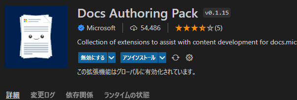
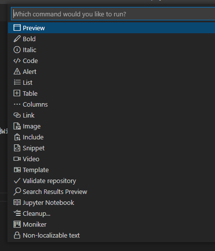
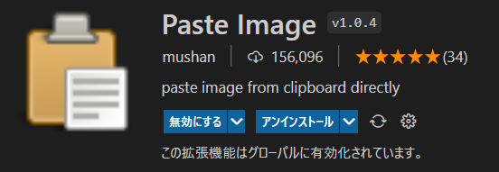
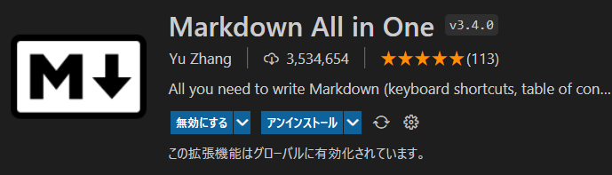

# test-proj
GIt練習用だよ

test文章
test branch3で追加  
test branch3で再度編集  
test branch3で再再度編集  
test branch3で再再再度編集  
test branch33333で編集中  

|Column1  |Column2  |
|---------|---------|
|Row1     |         |
|Row2     |         |

> [!CAUTION]
> Negative potential consequences of an action

:::note info
インフォメーション
infoは省略可能です。
:::

:::note warn
警告
○○に注意してください。
:::

:::note alert
より強い警告
○○しないでください。
:::

## Link

[Markdown記述チートシート](https://code-enj.app/post/2021-07-28-markdown-cheatsheet/)

[yahoo](https://www.yahoo.co.jp/)

[google](https://www.google.jp/)

[絵文字を表示する](https://www.webfx.com/tools/emoji-cheat-sheet/)

:smile:  
:triumph:  

## Markdown拡張機能
### 1.Docs Authoring Pack

**Alt+M**のショートカットキーで入力候補Windowから  
ひな形を選択して入力できます。  

これはかなりお勧めですね

### 2.Paste image

Ctrl + Alt + v でクリップボードの画像を貼り付けてくれる  
画像はmarkdownのファイルと同じ場所に保存されています。
> [!IMPORTANT]
> Ctrl + Alt + v で貼り付けてくれる
> 画像はmarkdownのファイルと同じ場所に保存されています。

### 3.Markdown All in One

ショートカットキーでMarkdownに変換してくれる  
WordやExcelのショートカットキーと似ているので直観で使える
#### Markdown All in oneショートカットキー

|キー  |説明  |
|---------|---------|
|ctrl+i               |イタリック         |
|ctrl+b               |太字         |
|Ctrl + Shift + ]     |見出しの切り替え(アップ)|
|Ctrl + Shift + [     |見出しの切り替え(ダウン)|
|Alt + C	          |チェックボックスの有効/無効|
|範囲選択 + Ctrl + V   |リンクの設定|

例)  
> [!TIP]
> *イタリック*で表示するときは**ctrl+i**  
**太字**で表示するときは***Ctrl＋ｂ**  