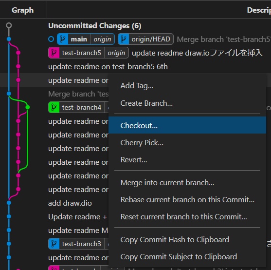

# 【VS Code】Gitオススメ拡張機能

## 1. Git Graph

  
Gitのログ（変更履歴）をGUI上に表示してくれます。

ブランチのごとにラインが表示されるので複数ブランチがある場合、視覚的に
見やすくなります。

コミット履歴から差分も簡単に確認できます。
  
その他に右クリックからタグの付けたり、ブランチのマージなども行えます。

## 2. GitLens

  
ソースコードなどのコードを行毎に誰が変更したかを表示してくれます。
謎のコードがあった場合、誰に確認すれば良いかすぐわかるようになります。

その他にもサイドバーに拡張されたサブメニューが表示されて色々できます
  

1. COMMITS
   現在のブランチのコミット一覧が表示されます
   その他にもPush、Pull、Fetch、ブランチ切替  
2. FILE HISTORY
   現在アクティブのファイルのコミット一覧が表示されます  

3. BRANCHES
   ブランチの一覧が表示されます  
   ブランチ作成、ブランチ切替  
4. REMOTES
   リモートリポジトリの情報が表示されます  
5. STASHES
   スタッシュしている一覧が表示されます（スタッシュしている内容が見れるので以外と便利です）  
   スタッシュ、スタッシュを戻す、スタッシュの削除  
6. TAGS
   タグ付けした情報の一覧が表示されます  
   TAGの追加  
7. SEARCH & COMPARE
   ・SEARCH  
     コミットログから検索ができます  
   ・COMPARE  
     ブランチの差分が見れます  
さまざまなことがGUIベースで操作可能です
